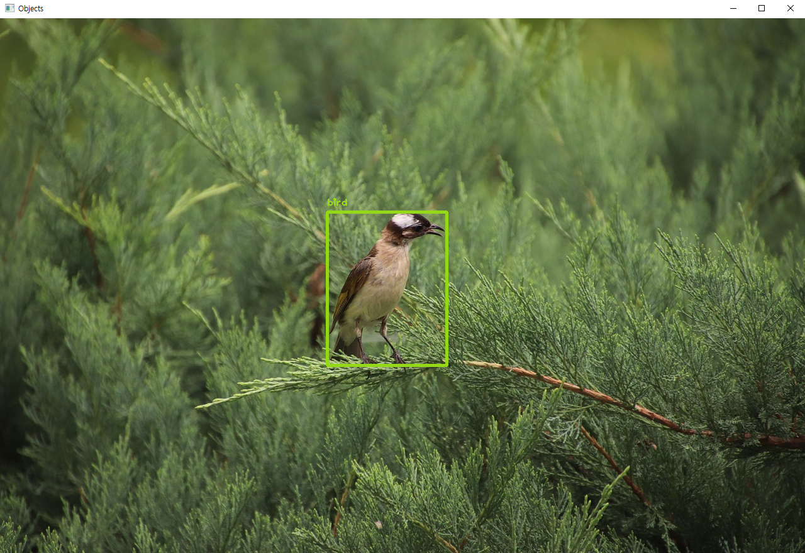
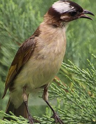

# Detect Animal in Image with OpenCV  

---
## Project Overview  
**Detect animal objects, display the detected objects, and save the information of the objects as text files**  
**A program that detects an object based on a given image and stores the image and information of that object**  

---
## Requirements: (with versions i tested on)
python (3.12.0)  
opencv (4.8.1)  
numpy (1.26.2)  

---
## How Do it?
1. Download **yolov.weights** => https://pjreddie.com/media/files/yolov3.weights 
2. Insert the desired image in the Image folder  
3. Enter the name of the image you saved in the console window  

---
## Results
**Detects animal objects from input images, displays detected objects in images, cuts only the displayed objects and stores them separately in a new folder.**
**And create a new text file that records the class, confidence, and coordinates of an object**
  
Find an animal object in an image and display it in the image  
  
Save only detected animal objects separately  

---
## References
https://github.com/opencv/opencv  
https://pixabay.com/ko/  